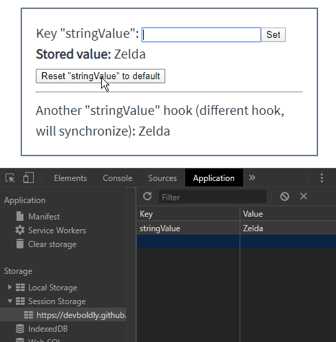

<h2 align="center">
  <a href="https://github.com/devboldly/react-use-window-sessionstorage">React Use Window.sessionStorage</a>
</h2>
<h3 align="center">
  React hooks for accessing the sessionStorage <a href="https://developer.mozilla.org/en-US/docs/Web/API/Web_Storage_API">Web Storage API</a>.
</h3>
<p align="center">
  <a href="https://badge.fury.io/js/react-use-window-sessionstorage">
    
  </a>
  <a href="https://github.com/devboldly/react-use-window-sessionstorage/actions?query=workflow%3ATests">
    
  </a>
  <a href="https://github.com/devboldly/react-use-window-sessionstorage/actions?query=workflow%3ADeploy">
    
  </a>
</p>

## Documentation

Read the **[official documentation](https://devboldly.github.io/react-use-window-sessionstorage/)**.

[](https://devboldly.github.io/react-use-window-sessionstorage/useSessionStorageString#example)

👁️ **[Live Demo](https://devboldly.github.io/react-use-window-sessionstorage/useSessionStorageString#example)**

## Overview

A set of hooks to easily store and retrieve data from [sessionStorage](https://developer.mozilla.org/en-US/docs/Web/API/Window/sessionStorage).

Encoding is handled for common data types, including [booleans](https://devboldly.github.io/react-use-window-sessionstorage/useSessionStorageBoolean), [numbers](https://devboldly.github.io/react-use-window-sessionstorage/useSessionStorageNumber), [strings](https://devboldly.github.io/react-use-window-sessionstorage/useSessionStorageString), and [objects](https://devboldly.github.io/react-use-window-sessionstorage/useSessionStorageObject), or you can [encode data yourself](https://devboldly.github.io/react-use-window-sessionstorage/useSessionStorageItem) if you'd like.

Changes to sessionStorage are synchronized across all hooks automatically.

> **What is sessionStorage?** The `sessionStorage` property allows you to store `{key: value}` string data that is cleared when the page session ends. A page session lasts as long as the browser is open, and survives over page reloads and restores.

> For localStorage, check out the companion project [react-use-window-localstorage](https://devboldly.github.io/react-use-window-localstorage).

### Features include:

- **💪 Easily add `sessionStorage` support**
  - Easily store data that is cleared when the page session ends.
- **🔢 Support for primitives and objects**
  - Store and retrieve strings, booleans, numbers, and objects effortlessly.
- **💁 Default values**
  - Optional support for defaults is baked right in.
- **🔄 Automatic synchronization**
  - Changes are synchronized across hooks automatically.
- **👾 Customizable**
  - Want to store something unusual? Just provide your own encoder.
- **⛔ Storage availability detection**
  - Detects if `sessionStorage` is available for use and lets you know otherwise.
- **🧼 Clearing support**
  - Clear all sessionStorage values and reset hooks to defaults with one simple call.

## Installation

```
npm i react-use-window-sessionstorage
```

## Quick Start

### Storing Strings

Use the [useSessionStorageString](https://devboldly.github.io/react-use-window-sessionstorage/useSessionStorageString) hook:

```jsx
import { useSessionStorageString } from 'react-use-window-sessionstorage';
```

In your function component:

```jsx
const defaultValue = 'cyan';
const [value, setValue] = useSessionStorageString('favColor', defaultValue);
```

### Storing Objects

Use the [useSessionStorageObject](https://devboldly.github.io/react-use-window-sessionstorage/useSessionStorageObject) hook:

```jsx
import { useSessionStorageObject } from 'react-use-window-sessionstorage';
```

In your function component:

```jsx
const defaultValue = { a: 'hello', b: 123 };
const [value, setValue] = useSessionStorageObject('myObj', defaultValue);
```

Note that your objects must be compatible with [JSON.stringify()](https://developer.mozilla.org/en-US/docs/Web/JavaScript/Reference/Global_Objects/JSON/stringify). Use [useSessionStorageItem](https://devboldly.github.io/react-use-window-sessionstorage/useSessionStorageItem) otherwise.

### Storing Booleans

Use the [useSessionStorageBoolean](https://devboldly.github.io/react-use-window-sessionstorage/useSessionStorageBoolean) hook:

```jsx
import { useSessionStorageBoolean } from 'react-use-window-sessionstorage';
```

In your function component:

```jsx
const defaultValue = true;
const [value, setValue] = useSessionStorageBoolean('swordEquipped', defaultValue);
```

### Storing Numbers

Use the [useSessionStorageNumber](https://devboldly.github.io/react-use-window-sessionstorage/useSessionStorageNumber) hook:

```jsx
import { useSessionStorageNumber } from 'react-use-window-sessionstorage';
```

In your function component:

```jsx
const defaultValue = 3.14159;
const [value, setValue] = useSessionStorageNumber('importantNumber', defaultValue);
```

> Note: All value defaults are optional. Hooks will return `null` if none is provided.

### Storing Everything Else

If you'd like to store something other than the data types above, define your own encoding using the [useSessionStorageItem](https://devboldly.github.io/react-use-window-sessionstorage/useSessionStorageItem) hook.

Here's a starting point:

```jsx
import { useSessionStorageItem } from 'react-use-window-sessionstorage';
```

In your function component:

```jsx
const defaultValue = 'something custom';
const encode = value => JSON.stringify(value);
const decode = itemString => JSON.parse(itemString);
const [value, setValue] = useSessionStorageItem('name', defaultValue, encode, decode);
```

Provide `null` for no default value.

### Additional Features

All hooks provide additional features in their return arrays, should you be interested:

```jsx
const [value, setValue, loading, available, reset, restore] = useSessionStorageString('favColor', 'cyan');
```

- A `loading` value of `true` indicates that the value is being loaded from sessionStorage.
- An `available` value of `true` indicates that `sessionStorage` is supported and available for use. 
- The `reset()` function sets the value back to the provided default, or `null` if none was given.
- The `restore()` function retrieves the latest value from sessionStorage. Use this if the sessionStorage value changes outside of this hook and you need to restore it to the latest.

### Clearing `sessionStorage`

```jsx
import { useClear } from 'react-use-window-sessionstorage';
```

```jsx
const clearSessionStorage = useClearSessionStorage();
```

Call `clearSessionStorage()` to clear all values in sessionStorage using [sessionStorage.clear()](https://developer.mozilla.org/en-US/docs/Web/API/Window/sessionStorage) 
and reset all hooks to their defaults (or `null` if none provided).

## TypeScript

Type definitions have been included for [TypeScript](https://www.typescriptlang.org/) support.

## Logo Attribution

Logo graphics by [Twemoji](https://github.com/twitter/twemoji), licensed under [CC-BY 4.0](https://creativecommons.org/licenses/by/4.0/). Favicon by [favicon.io](https://favicon.io/emoji-favicons/).

## Contributing

Open source software is awesome and so are you. 😎

Feel free to submit a pull request for bugs or additions, and make sure to update tests as appropriate. If you find a mistake in the docs, send a PR! Even the smallest changes help.

For major changes, open an issue first to discuss what you'd like to change.

See [Kindling](https://tinyurl.com/kindlingscripts) for npm script documentation.

## ⭐ Found It Helpful? [Star It!](https://github.com/devboldly/react-use-window-sessionstorage/stargazers)

If you found this project helpful, let the community know by giving it a [star](https://github.com/devboldly/react-use-window-sessionstorage/stargazers): [👉⭐](https://github.com/devboldly/react-use-window-sessionstorage/stargazers)

## MIT License

```
Copyright © 2020 DevBoldly https://devboldly.com

Permission is hereby granted, free of charge, to any person obtaining a copy
of this software and associated documentation files (the "Software"), to deal
in the Software without restriction, including without limitation the rights
to use, copy, modify, merge, publish, distribute, sublicense, and/or sell
copies of the Software, and to permit persons to whom the Software is
furnished to do so, subject to the following conditions:

The above copyright notice and this permission notice shall be included in all
copies or substantial portions of the Software.

THE SOFTWARE IS PROVIDED "AS IS", WITHOUT WARRANTY OF ANY KIND, EXPRESS OR
IMPLIED, INCLUDING BUT NOT LIMITED TO THE WARRANTIES OF MERCHANTABILITY,
FITNESS FOR A PARTICULAR PURPOSE AND NONINFRINGEMENT. IN NO EVENT SHALL THE
AUTHORS OR COPYRIGHT HOLDERS BE LIABLE FOR ANY CLAIM, DAMAGES OR OTHER
LIABILITY, WHETHER IN AN ACTION OF CONTRACT, TORT OR OTHERWISE, ARISING FROM,
OUT OF OR IN CONNECTION WITH THE SOFTWARE OR THE USE OR OTHER DEALINGS IN THE
SOFTWARE.
```